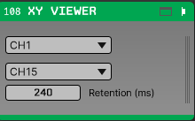
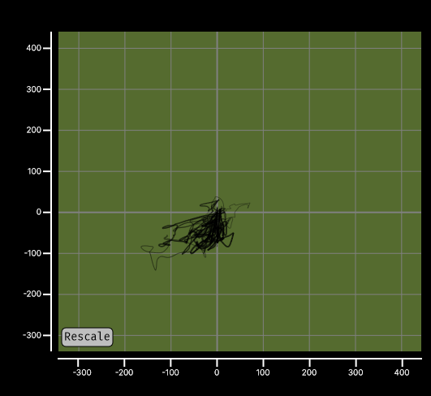

# XY Viewer

An Open Ephys GUI plugin that plots one continuous channel against another in
real time, e.g. for phase-plane / phase-portrait style views of two related
signals. The trace fades from faint to solid along its length, so the most
recent samples stand out from the older ones still in the retention window.

```
Acquisition Board -> XY Viewer
```

## Usage

Add **XY Viewer** (under Sinks) to the signal chain. In the editor, pick a
stream and choose the **X** and **Y** channels from the two dropdowns, and set
the retention period; the canvas plots `Y` vs `X` for the selected pair,
redrawing continuously during acquisition.



The plot is interactive: scroll to zoom, drag to pan, and use the **Rescale**
button to fit the view back to the current data. Channel selection, retention
period, and the current pan/zoom range are all restored the next time the
signal chain is loaded.



## Parameters

| Name | Scope | Default | Notes |
|---|---|---|---|
| `Retention (ms)` | Processor | 2000 | How much trace history (in ms) to keep on screen, 100–10000 |

## Building

Requires the Open Ephys GUI checked out as a sibling directory, or the
`GUI_BASE_DIR` environment variable pointing at it:

```
open-ephys/
├── plugin-GUI/
└── OEPlugins/
    └── xy-viewer/
```

### Windows

**Requirements:** [Visual Studio](https://visualstudio.microsoft.com/) and [CMake](https://cmake.org/install/)

From the `Build` directory:

```bash
cmake -G "Visual Studio 17 2022" -A x64 ..
```

Open the generated `OE_PLUGIN_xy-viewer.sln` in Visual Studio, select a
configuration (Debug/Release), and build the solution. Building the `INSTALL`
project copies the `.dll` into the GUI's `plugins` directory.

### Linux

**Requirements:** [CMake](https://cmake.org/install/)

From the `Build` directory:

```bash
cmake -G "Unix Makefiles" -DCMAKE_BUILD_TYPE=Release ..
make -j
make install
```

### macOS

**Requirements:** [Xcode](https://developer.apple.com/xcode/) and [CMake](https://cmake.org/install/)

From the `Build` directory:

```bash
cmake -G "Xcode" ..
```

Open the generated `xy-viewer.xcodeproj` in Xcode and run the `ALL_BUILD` /
`INSTALL` schemes.

## License

GPL-3.0. See [LICENSE](LICENSE).
